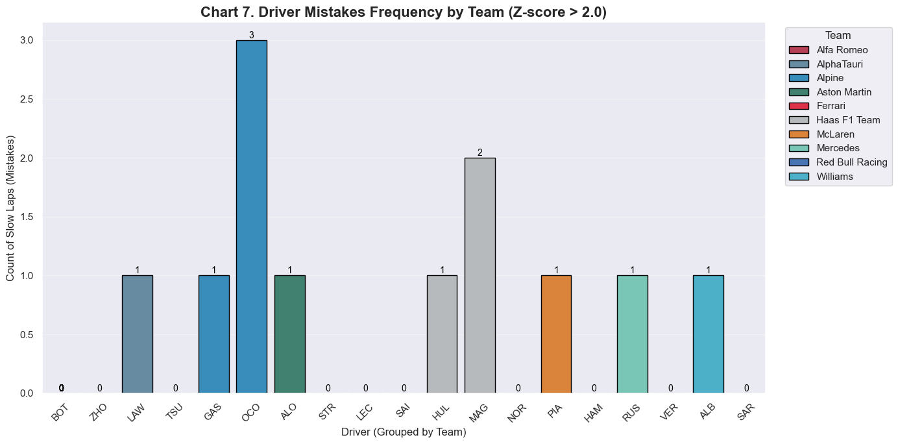
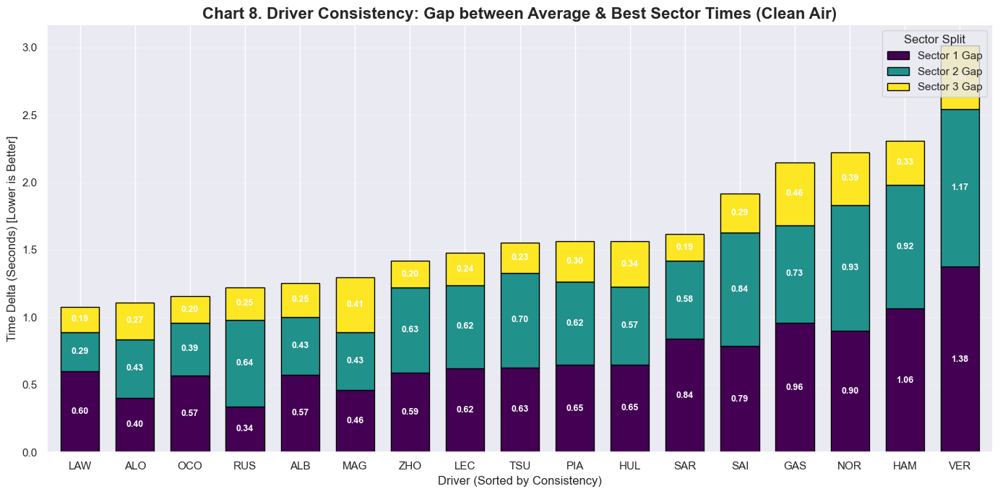
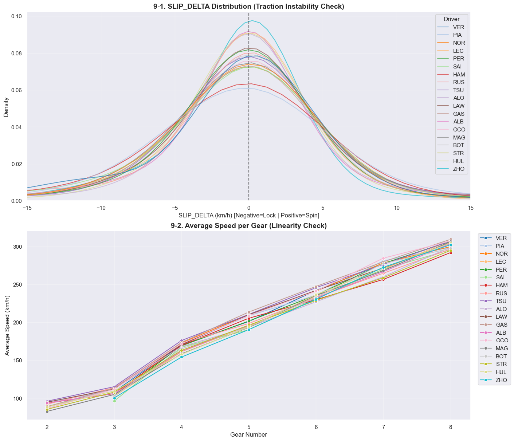
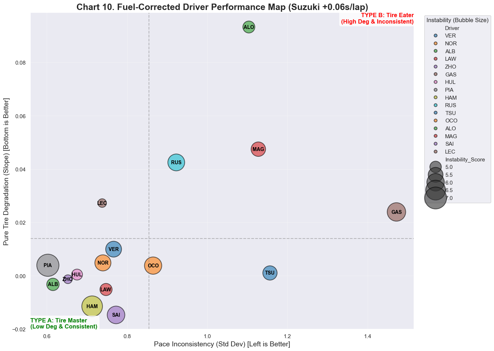

## Outlier Detection
* Race (Clean Air)에서 랩타임의 분포를 봤을 때, 2.5 이상 넘어가는 빈도를 시각화

## Driver Sector Stability
* 각 섹터의 Best Time과 Average Time을 계산하여 Gap을 구하고, 이를 통해 일관성을 평가
🏆 Top 3 Most Consistent Drivers (Lowest Total Gap):
        Total Gap
Driver           
LAW      1.077389
ALO      1.109964
OCO      1.155000

⚠️ Least Consistent Drivers (Highest Total Gap):
        Total Gap
Driver           
NOR      2.224024
HAM      2.309923
VER      3.016238

* 상위권 드라이버인 노리스, 해밀턴, 베르슈타펜 등이 일관성이 낮게 나오고, 하위권 드라이버가 일관되게 나오는데 어떻게 해석할지?

## RPM-Speed Difference (SLIP_DELTA Distribution)
* 피처 엔지니어링을 통해 얻은 SLIP_DELTA 검증
* Estimated_Speed = RPM * Ratio
* Ratio = nGear별 Speed / RPM의 평균 비율
* SLIP_DELTA = Estimated_Speed - Actual_Speed

🔍 [Data Check] Drivers with highest instability (Mean Abs Slip Delta):
Driver
PIA    7.065602
HAM    6.693028
GAS    6.192373
STR    6.021561
SAI    6.015430
OCO    5.948284
RUS    5.865414
NOR    5.722103
VER    5.675805
BOT    5.548583
PER    5.446946
MAG    5.435372
TSU    5.408529
ALB    5.120720
LAW    5.087389
ALO    5.060614
HUL    4.920577
ZHO    4.675243
LEC    4.662403

* 역시 상위권 드라이버의 값이 높게 나오고, 하위권 드라이버의 값이 낮게 나오는데 어떻게 해석할지?

## Driver Performance Map (Clustering)
* 
