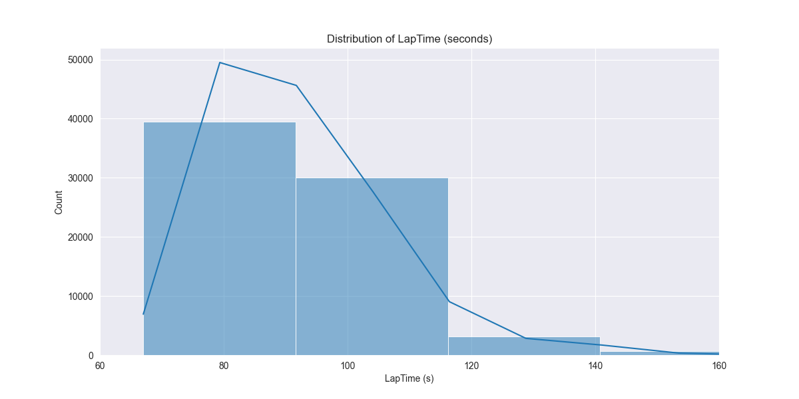
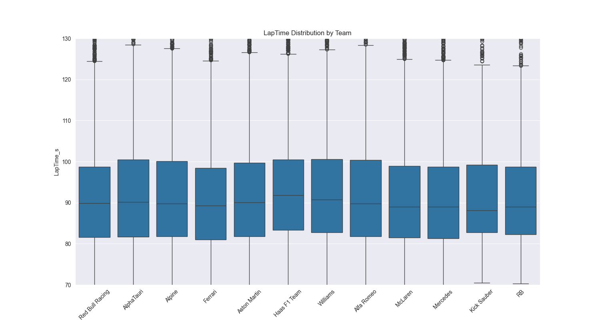
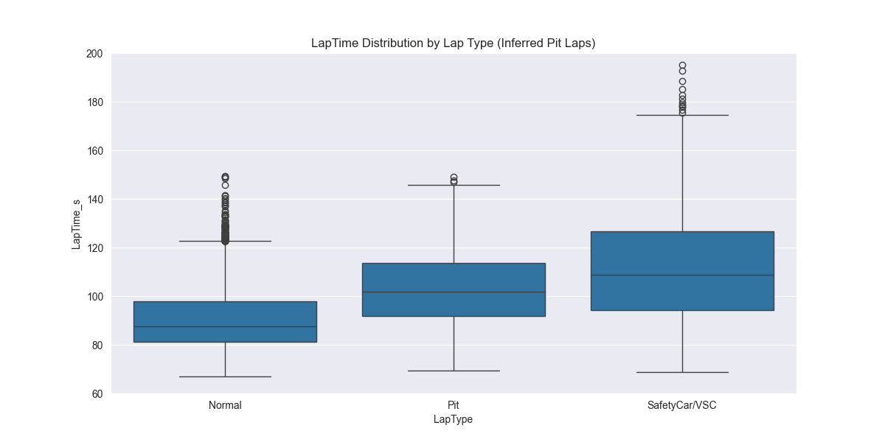
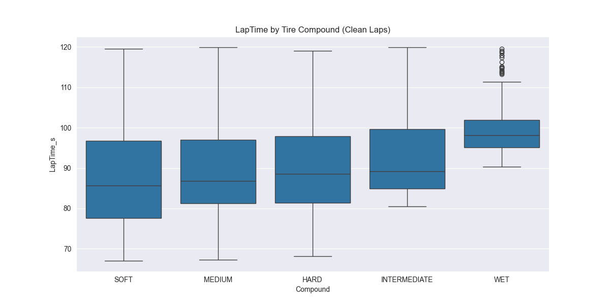

## EDA Findings

### [A] LapTime Distribution

### [B] Outliers & Noise

- **Pit Laps**: Average 115.57s vs Normal 90.99s
- **Safety Car**: Average 115.90s vs Green Flag 90.08s

### [C] Compound Impact

**Average Lap Time by Compound:**
- **SOFT**: 87.88s
- **MEDIUM**: 88.98s
- **HARD**: 89.44s
- **INTERMEDIATE**: 92.76s
- **WET**: 99.78s
